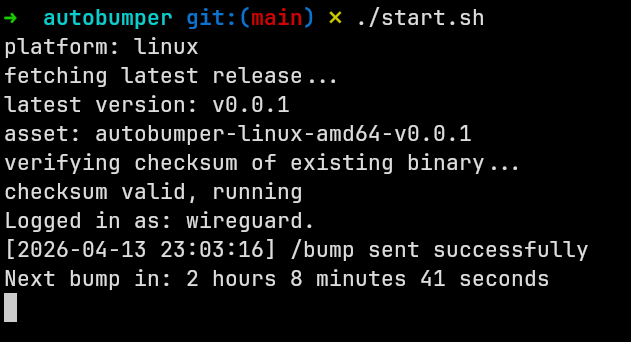

# Autobumper 

## Overview


a tiny app that bumps your discord server written in go.

autobumper uses [discoself](https://github.com/krishnassh/discoself) which interacts with the Discord client API in ways that are outside Discord's official bot platform. Use of selfbots violates Discord's Terms of Service. I am not responsible for any misuse of this project or any consequences that may arise from its use.

### How it works

Once connected, the selfbot sends the Disboard `/bump` slash
command and then repeats randomly between 2 hours and 2.5 hours to prevent any kind of detection from disboard's side. It matches the command
by both name **and** Disboard's application ID (`302050872383242240`), so it
will never accidentally trigger another bot's `bump` command if multiple bots
in your server register one.

### Getting Arguments 

You will need to enable **Developer Mode** in Discord to copy IDs.
Go to `Settings -> Advanced -> Developer Mode` and toggle it on. Then:

- **Guild ID:** Right-click your server icon and select `Copy Server ID`.
- **Channel ID:** Right-click the channel you want to bump in and select `Copy Channel ID`.

- **User Token:** See [this guide](https://gist.github.com/KrishnaSSH/b518ec90cd54f33d70a7d4525e9258a2) for how to obtain your user token

## How to Run


## Windows

Open Command Prompt or PowerShell and run:

```bat
powershell -Command "Invoke-WebRequest https://raw.githubusercontent.com/KrishnaSSH/autobumper/refs/heads/main/start.bat -OutFile start.bat"
start.bat
```

Or download manually:

1. Open the following URL in your browser:
   [https://raw.githubusercontent.com/KrishnaSSH/autobumper/refs/heads/main/start.bat](https://raw.githubusercontent.com/KrishnaSSH/autobumper/refs/heads/main/start.bat)
2. Save the file as start.bat
3. Double click start.bat to run it

---

## Linux and macOS

Open a terminal and run:

```bash
curl -fsSL https://raw.githubusercontent.com/KrishnaSSH/autobumper/refs/heads/main/start.sh | bash
```

Or download and run manually:

```bash
curl -fsSL https://raw.githubusercontent.com/KrishnaSSH/autobumper/refs/heads/main/start.sh -o start.sh
chmod +x start.sh
./start.sh
```

---

